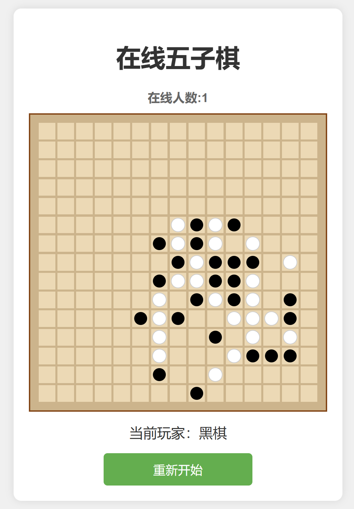

# Gomoku-web

<div style="display: inline-block; box-shadow: 10px 10px 10px rgba(0, 0, 0, 0.9);">
  
</div>

A web-based Gomoku game using Flask and Socket.IO. 一个使用 Flask 和 Socket.IO 实现的基于 Web 的五子棋游戏。

You can play the game at [gomoku.wangzixi.top](https://gomoku.wangzixi.top). 你可以在 [gomoku.wangzixi.top](https://gomoku.wangzixi.top) 上玩这个游戏。

## Features

- Lightweight design, no forbidden hands, no restrictions on whose turn it is to play 轻量级设计，无禁手，无限制谁的回合
- Real-time gameplay using WebSockets 使用 WebSockets 进行实时游戏
- Intuitive UI 直观的用户界面

## Usage

### Setup Instructions

Follow these steps to set up the project:

```bash
conda create --name web python=3.9
conda activate web
pip install flask flask-socketio eventlet
```

### Running the Server

To start the server, run the following command:

```bash
python server.py
```